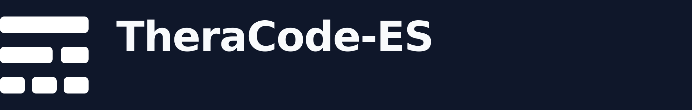

  

# TheraCode

  A clean foundation for independent machine learning research and engineering.

  <a href="https://github.com/Theracode-ES/theracode-template">template</a> · <a href="https://github.com/Theracode-ES/theracode-llm">models</a>

 

  

---

## 🎯 Purpose

We build tools and model projects for machine learning research. Our work starts from reusable Python and PyTorch foundations, with room for each project to choose its own architecture, data, and objectives.

## 📦 Projects

- **[theracode-template](https://github.com/Theracode-ES/theracode-template)** — a reusable starting point for independent model projects.
- **[theracode-llm](https://github.com/Theracode-ES/theracode-llm)** — the language model project.

## 🤝 Get involved

- Explore the project repositories and their documentation.
- Open an issue in the relevant repository to report a bug or suggest an improvement.
